# Meraki Camera YouTube Streaming

Meraki offers multiple build in features to view the Meraki MV camera footage in the Meraki dashboard. For the integration with 3rd party video surveillance systems and more, a Real Time Streaming Protocol (RTSP) option is available. Thereby, the RTSP stream is natively only available within the Meraki camera network itself. This demo demonstrates how a Meraki RTSP stream can be exposed/streamed externally via Open Broadcaster Software (OBS) and YouTube Studio. Furthermore, it shows how the stream can be embedded in a custom external webpage.

## Contacts
* Ramona Renner (ramrenne@cisco.com)

## Demo Components
* Meraki MV Camera and Dashboard
* YouTube Studio 
* Open Broadcaster Software (OBS)
* (Optional) VLC Media Player   

## Workflow

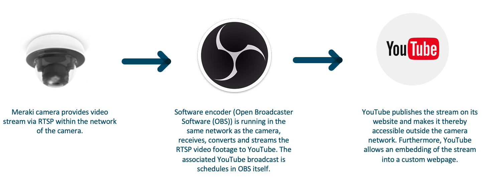

Besides the Meraki cameras and dashboard, this demo relies on the following tools: 

**Open Broadcaster Software (OBS) version 28.1.2**:     
OBS is a free and open source software for video recording and live-streaming. This demo uses OBS to: 
1. Retrieve the local Meraki RTSP video stream
2. Create a YouTube Broadcast
3. Stream Meraki MV camera footage to YouTube   

OBS is not limited to use with YouTube, but also supports multiple other streaming platforms.    
More information about OBS is available under: https://obsproject.com  


**YouTube Studio**:   
YouTube Studio is a tool provided by YouTube that allows you to manage your own channel and YouTube Live streams. Besides the sole streaming it offers many more functionalities like chat, analytics etc.  
Unlisted and public YouTube Live streams can furthermore be easily embedded into an external webpage.    
YouTube Studio does support multiple encoders. One of them is OBS.       
This demo uses YouTube to publish the stream on YouTube Live (externally) and embed it into an external webpage.   
YouTube Studio is available under: https://studio.youtube.com


**(Optional) VLC Media Player**   
VLC is a free and open source cross-platform multimedia player and framework that plays most multimedia files as well as DVDs, Audio CDs, VCDs, and various streaming protocols.
This demo uses VLC media player to test the availability of the local Meraki RTSP stream.   
More information about VLC media player is available under: https://www.videolan.org/vlc/


## Prerequisite

### Enable External Meraki Camera RTSP   
Login to Meraki Dashboard,
  1. Go to **Cameras** > **Monitor: Cameras**
  2. Click the name of the camera to be live-streamed
  3. Select the **Settings** > **Video Settings** tabs and scroll down
  4. Choose **Enabled** in the section **External RTSP**
  5. Save the RTSP stream link value for a later step (format: **rtsp://[ip]:9000/live**)


### Create a YouTube Studio Account and Verify your Channel
Go to [YouTube Studio](https://studio.youtube.com),
  1. Create a new or log into an available account 
  2. Click **Create** > **Go live** 
  3. If you haven't already, follow the steps to **verify your channel**. Starting your first live stream may take up to 24 hours. Once enabled, you can live stream instantly.
  > To live stream, you need to have no live-streaming restrictions in the past 90 days and you need to verify your channel.


### Install Open Broadcaster Software (OBS) - Version 28.1.2  
Go to https://obsproject.com
  1. Download OBS version 28.1.2
  2. Install OBS on a machine within the Meraki camera network


### (Optional) Install VLC Media Player   
Go to https://www.videolan.org/vlc/
  1. Download VLC
  2. Install VLC on a machine within the Meraki camera network


### Allow Incoming Connections to VLC and OBS
Make sure the firewall on the machine allows incoming connections to VLC and OBS.


## Installation

Execute the following sections on a machine running in the same network as the Meraki camera.

### (Optional) Test Local Connection to Meraki RTSP Stream
In VLC media player,
1. Go to **File** in the main menu > click **Open Network**
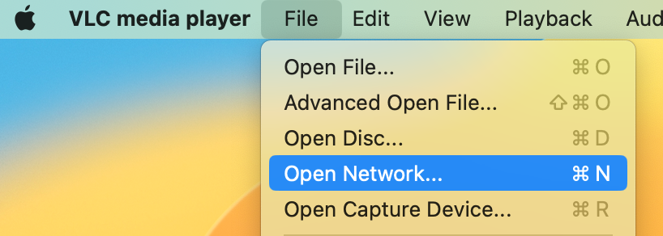
2. Fill in the Meraki RTSP address from the section **Enable External Meraki Camera RTSP** in the **URL** field > click **Open** 
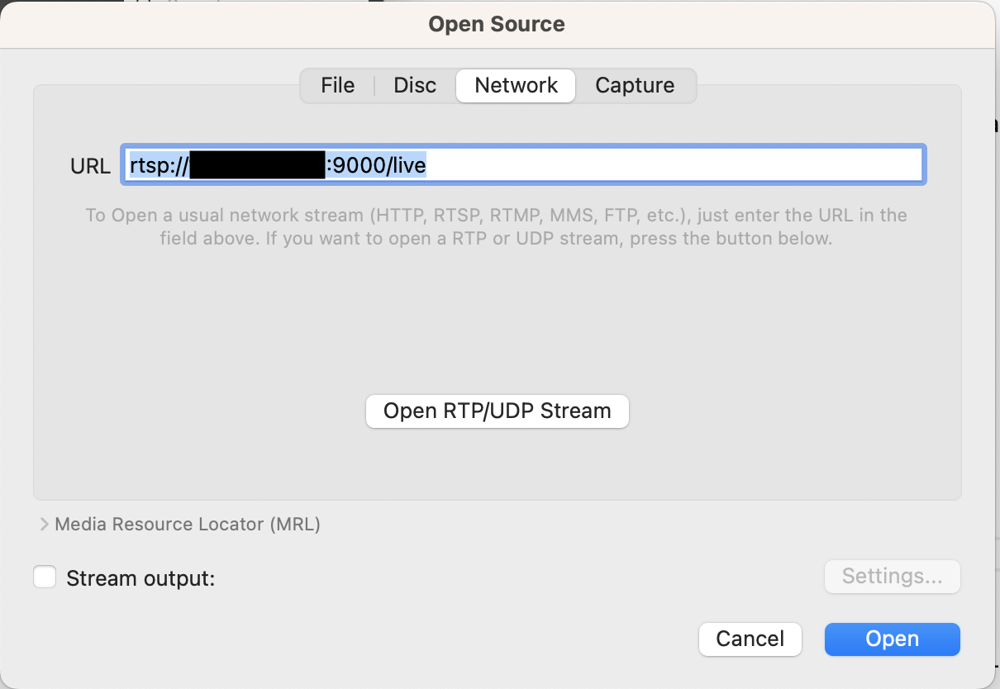
3. The VLC media player should show the Meraki RTSP stream in a new window - this might take some time.


### Receive Meraki RTSP Video Footage in OBS
In OBS:
1. In the **Scene** panel: Create a new or select an available scene 
2. In the **Source** panel: Click **+** > **VLC Video Source**.   
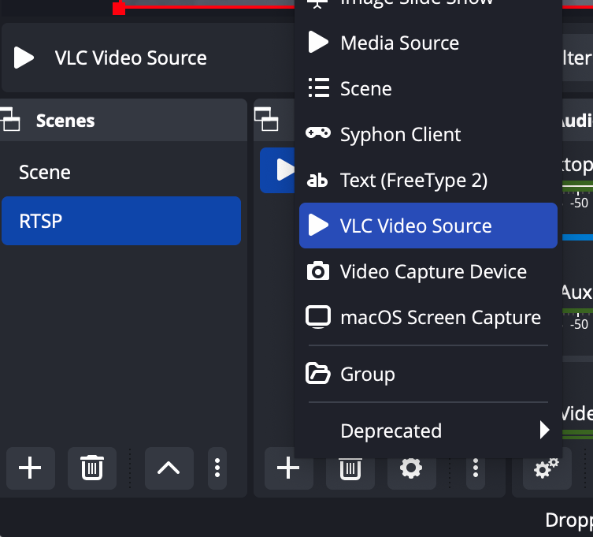
3. Select **Create New** and enter the preferred source name   
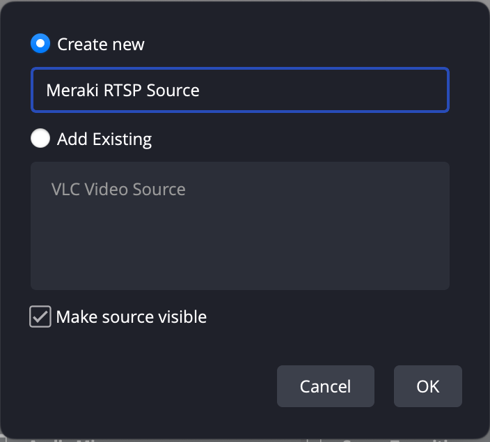
4. Click the **+** button next to the **Playlist** area > click **Add Path/URL**
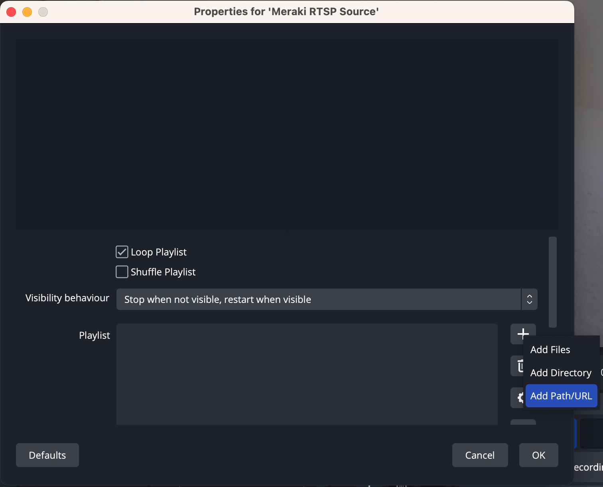
5. Fill in the Meraki RTSP address > click **Ok** > click **Ok**
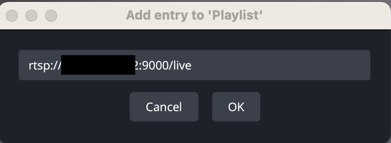
6. Press the play (or retry) button for the video source, if not already triggered automatically.
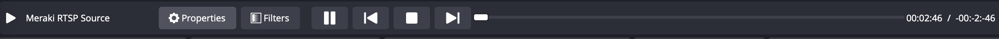   
The video feed should be displayed in OBS - it might take some time until the video is displayed in the UI.
 

### Connect YouTube Studio Account to OBS
For the following section, YouTube Live streaming needs to be successfully enabled for an associated account (see section **Create a YouTube Studio Account and Verify your Channel**).   
In OBS,
1. Go to **OBS Studio** in the main menu > click **Preferences**
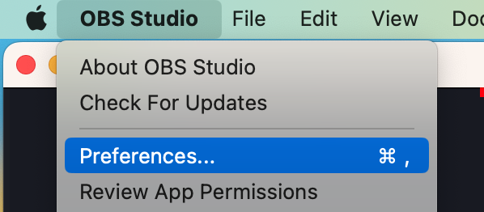
2. Select **Stream** in the side menu
3. Select the **"YouTube - RTMPS"** **Service** > click the **Connect Account (recommended)** button
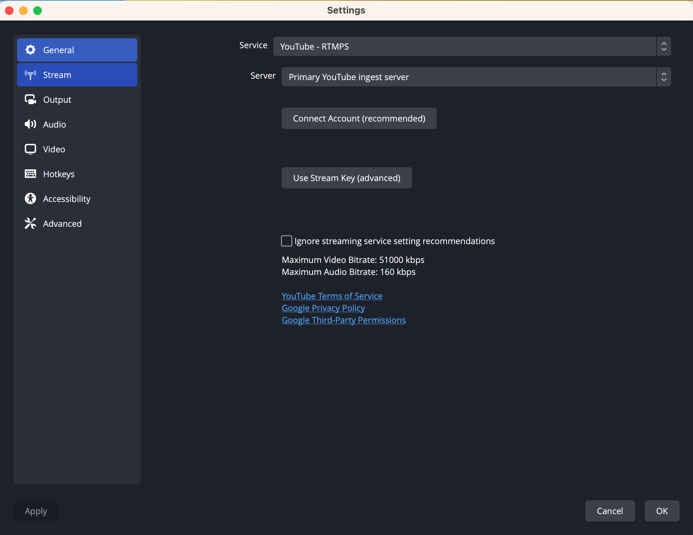
4. A browser window automatically opens. Follow the steps in the browser to allow OBS Studio to access your Google/YouTube account. 
5. Click **OK** to close the settings modal


### Create Broadcast/Stream (in YouTube) via OBS
The following steps will create a stream/broadcast in YouTube Studio from within OBS.   
In OBS:

1.  In the **Controls** panel:   
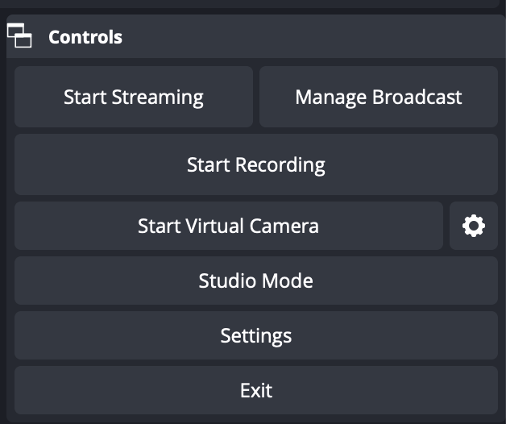   
2. (Optional for reduced delay) Click **Settings**:
* Click **Advanced** in local menu > Disable the **Stream Delay** feature and enable the **Automatically Reconnect** feature with the minimum **Retry Delay** value.
* Click **Video** in local menu: Make sure that the **Base (Canvas) Resolution** and **Output (Scaled) Resolution** fields have the same value. Select a high value for the **Common FPS Values** field, e.g. 60. 
* Click **OK**
3. Click **Manage Broadcast** in the **Controls** Panel. 
4. In the **Create New Broadcast** tab: Fill in the information related to the YouTube broadcast/stream to create. To embed the YouTube stream into an external website, stream privacy needs to be “unlisted” or “public”. (Optional for reduced delay) Set the field **Latency** in the **Additional settings** section to **Ultra Low** or **Low**.   
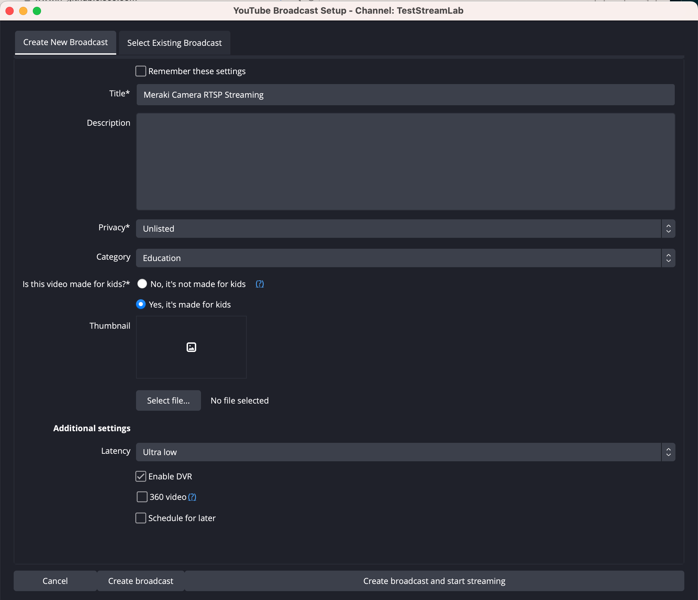   
5. Click **Create broadcast and start streaming**

> Note: Unlisted videos can be seen and shared by anyone with the link. They won’t appear to others who visit the "Videos" tab of your channel page and shouldn't show up in YouTube's search results unless someone adds an Unlisted video to a Public playlist. However, they are not Private. 

        
   

The following sections can be executed on any machine - within or external to the camera network.


### Watch and Share the YouTube Stream
In [YouTube Studio](https://studio.youtube.com),
1. Login 
2. Click **Create** in the top right corner > select the **Go Live** element
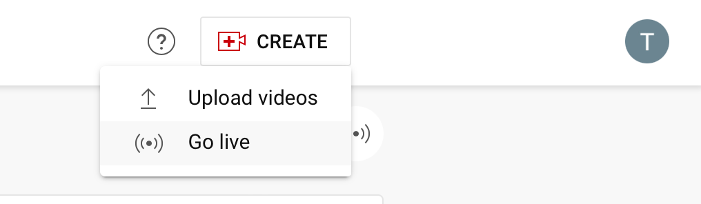 
3. Click the name of the created broadcast (see section **Create Broadcast/Stream (in YouTube) via OBS**) to access the stream details page
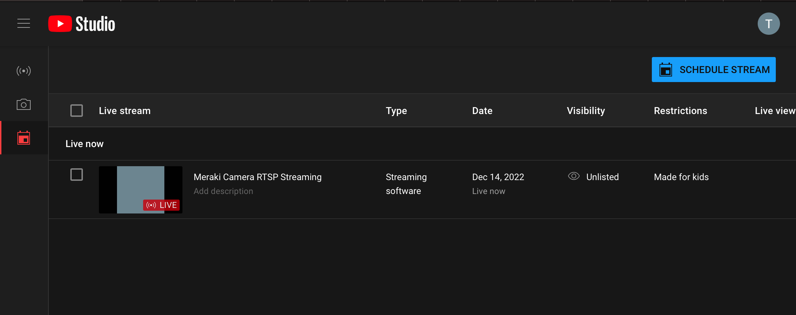
4. Select the **STREAM SETTINGS** tab > deselect the **Enable Auto-stop** toggle in the **Additional settings** section
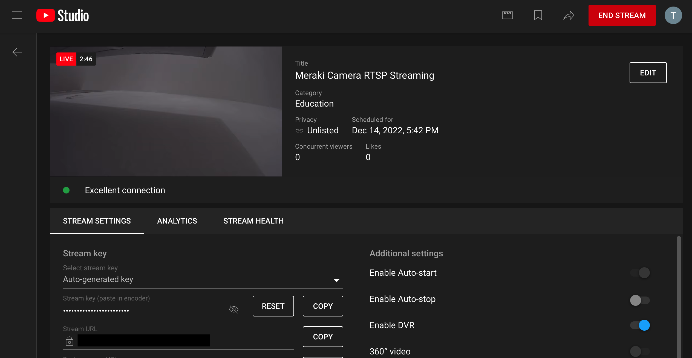
5. Click on the **share (icon)** button 
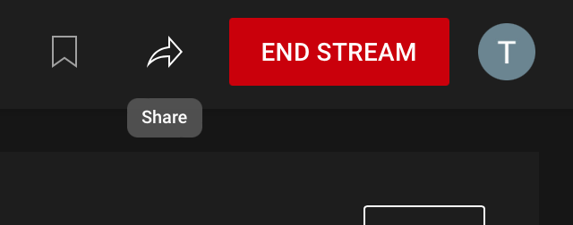
6. Choose the preferred sharing method, or copy the link to access the stream in a browser.
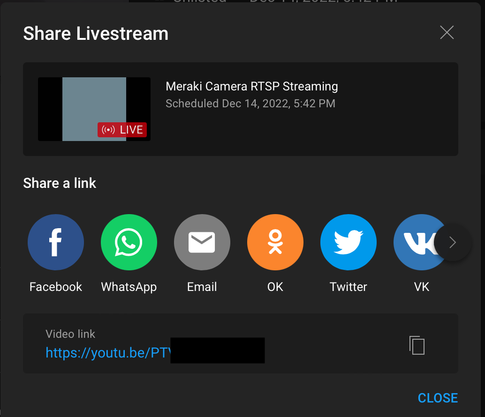


### Embed the YouTube Stream into an External Webpage
On the stream detail page from the last section,
1. Click the **EDIT** button next to the video element 
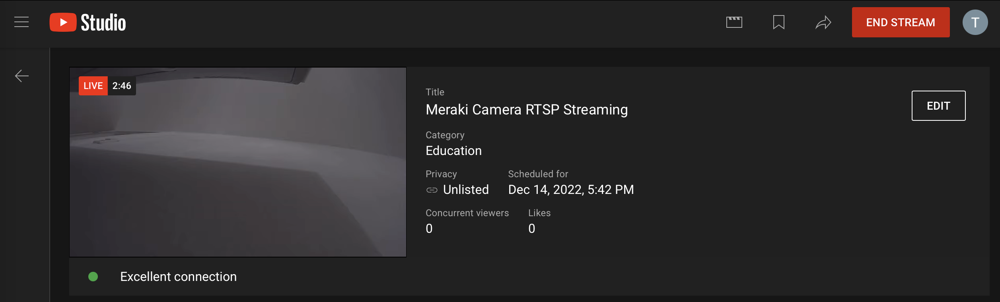
2. Scroll to the **License** section > select the **Allow embedding** option > **Save**
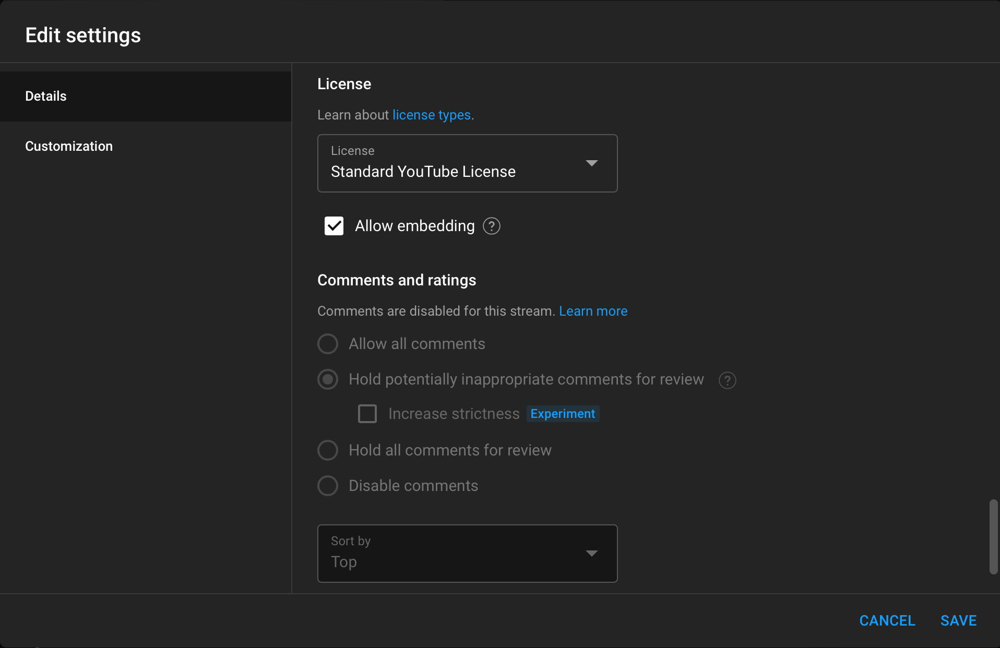
3. Use the **stream link** from the last section to access the stream
4. Right-click on the video > click **Copy Embed Code** 
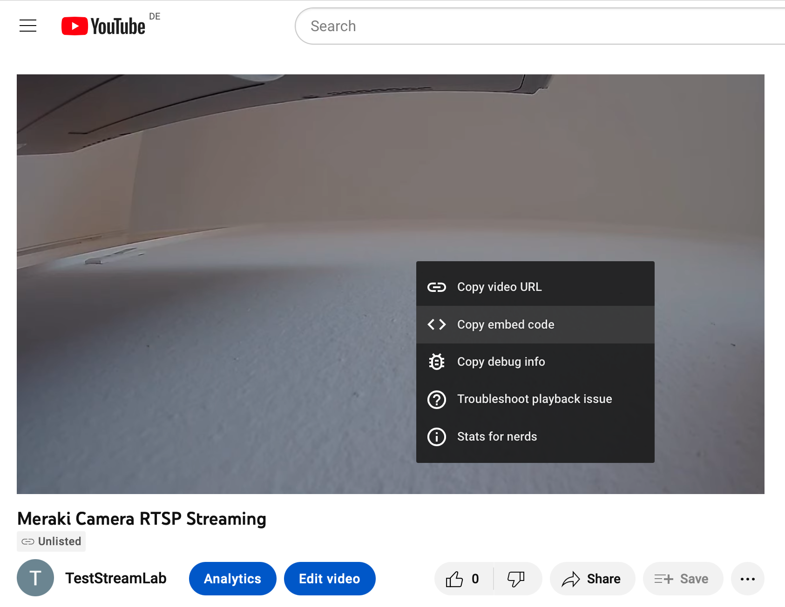
5. Past the copied code into the preferred webpage at the preferred position.   
The code typically has the following format:
```
<iframe width="803" height="452" src="https://www.youtube.com/embed/xxxxx" 
title="Meraki Camera RTSP Streaming" frameborder="0" allow="accelerometer; 
autoplay; clipboard-write; encrypted-media; gyroscope; picture-in-picture" 
allowfullscreen></iframe>
```   
   
For testing purposes and if no own external webpage is available: 
  1. Download the **youtube_embedding.html** from this repository 
  2. Open the file with a text editor or IDE (e.g. Visual Studio Code)
  3. Fill in the copied code from step 5 at the marked position in the HTLM file
  4. Save the file
  5. Open the file in a browser to view the embedded stream


## Further resources
* Meraki RTSP documentation: https://documentation.meraki.com/MV/Advanced_Configuration/External_RTSP
* Open Broadcaster Software: https://obsproject.com
* OBS wiki: https://obsproject.com/wiki/
* VLC Media Player: https://www.videolan.org/vlc/
* VLC guide: https://wiki.videolan.org/Documentation:User_Guide/
* YouTube Studio: https://studio.youtube.com
* YouTube Live Streaming guide: https://support.google.com/youtube/answer/2474026?hl=en&ref_topic=9257984
* Public RTSP stream for testing: https://www.wowza.com/developer/rtsp-stream-test


### Screenshot

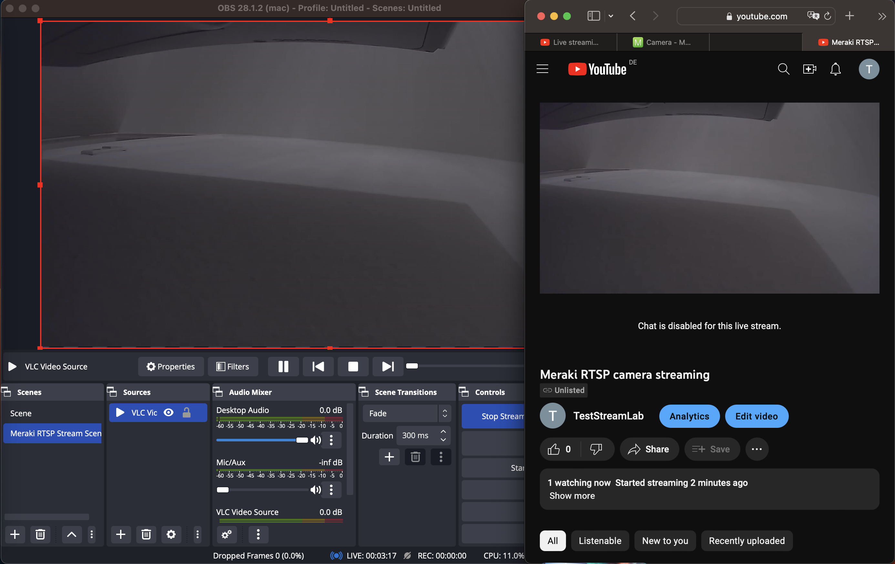

### LICENSE

Provided under Cisco Sample Code License, for details see [LICENSE](LICENSE.md)

### CODE_OF_CONDUCT

Our code of conduct is available [here](CODE_OF_CONDUCT.md)

### CONTRIBUTING

See our contributing guidelines [here](CONTRIBUTING.md)

#### DISCLAIMER:
<b>Please note:</b> This script is meant for demo purposes only. All tools/ scripts in this repo are released for use "AS IS" without any warranties of any kind, including, but not limited to their installation, use, or performance. Any use of these scripts and tools is at your own risk. There is no guarantee that they have been through thorough testing in a comparable environment and we are not responsible for any damage or data loss incurred with their use.
You are responsible for reviewing and testing any scripts you run thoroughly before use in any non-testing environment.